# TaskFlow - Task Management Application

<p align="center">
A modern and responsive Task Management Application built using React.
</p>

<p align="center">
TaskFlow helps users organize, manage, and track their daily tasks with an interactive dashboard, search, filtering, sorting, and local storage persistence.
</p>

## Overview

TaskFlow is a React-based Task Management Application developed as part of the React Foundation Assignment.

The application provides a clean and responsive interface where users can create, update, delete, and manage tasks efficiently without requiring a backend.

All task data is stored in browser LocalStorage, allowing users to keep their tasks available even after refreshing the application.

# Features

## Authentication UI

* Login Page 
* Register Page 

## Dashboard

* Total Tasks count
* Completed Tasks count
* Pending Tasks count
* Responsive dashboard layout

## Task Management

Users can:

* Add new tasks
* Edit existing tasks
* Delete tasks
* Mark tasks as completed
* Mark tasks as pending
* Add task description
* Set priority (High / Medium / Low)
* Add due dates

## Search & Filtering

Search tasks by:

* Task title
* Task description

Available filters:

* All Tasks
* Completed Tasks
* Pending Tasks
* High Priority
* Medium Priority
* Low Priority

## Sorting

Tasks can be sorted by:

* Recently Added
* Priority
* Due Date

## Data Persistence

* Uses browser LocalStorage
* Tasks remain available after page refresh

# Screenshots

## Home Page

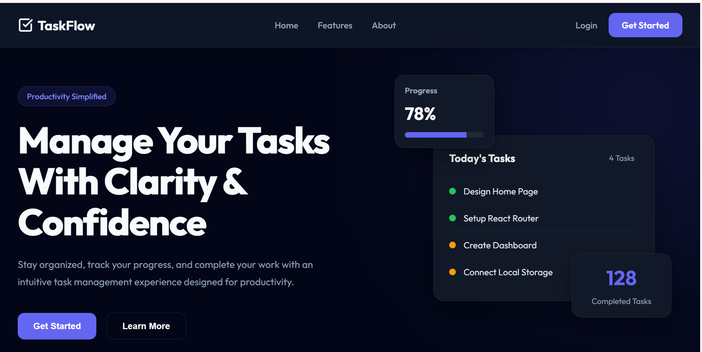

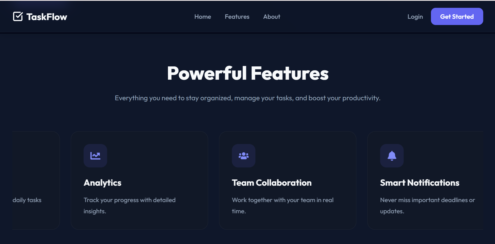

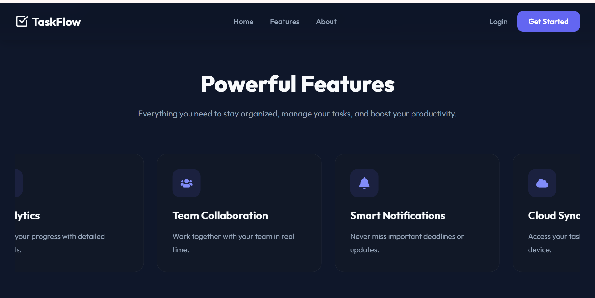

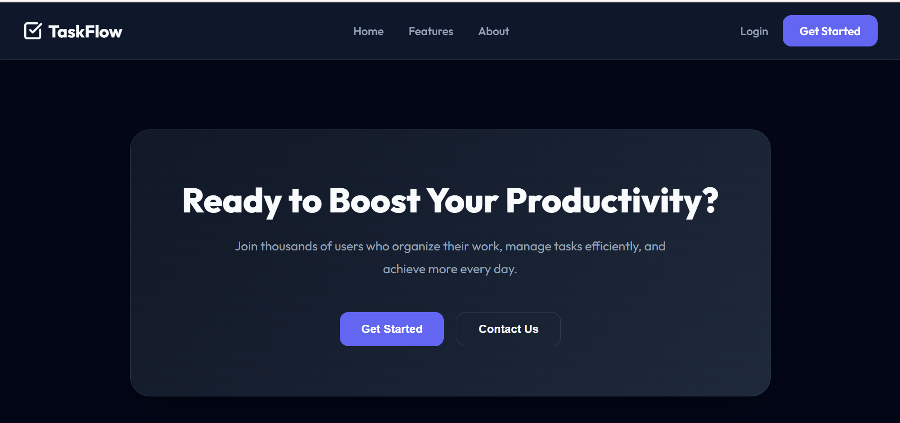

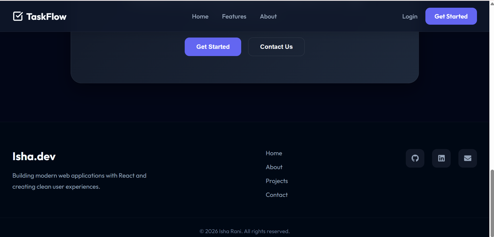

## Login Page

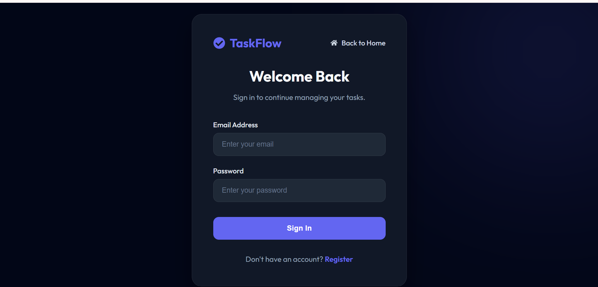

## Register Page

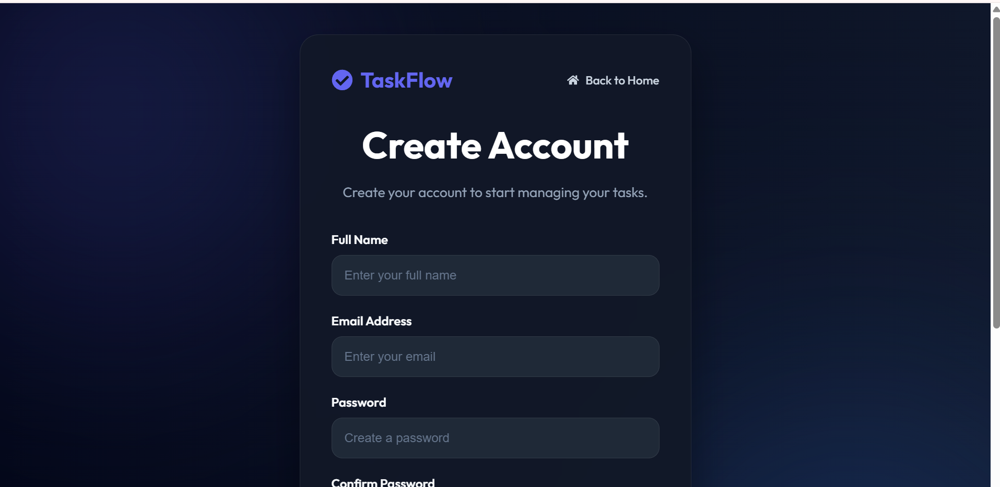

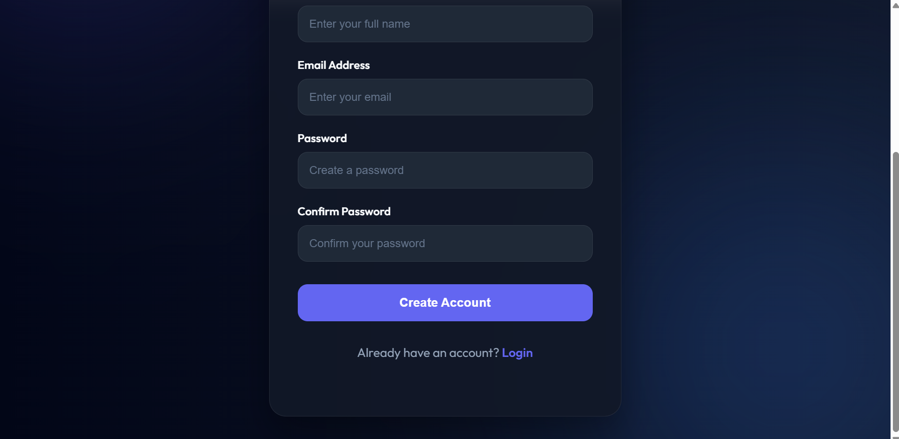

## Dashboard

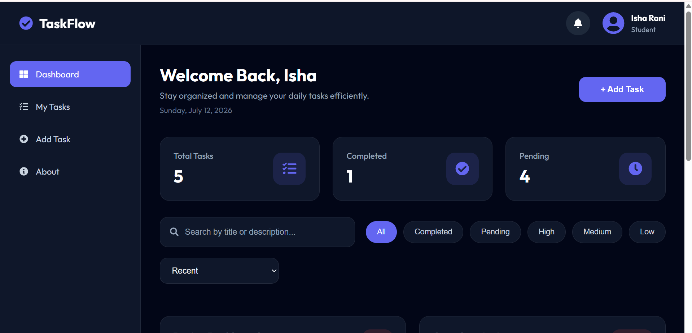

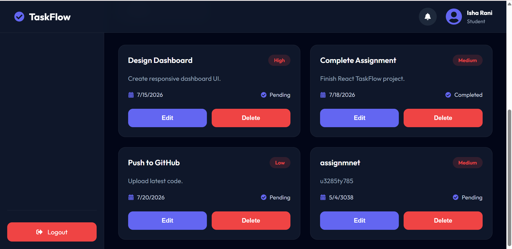

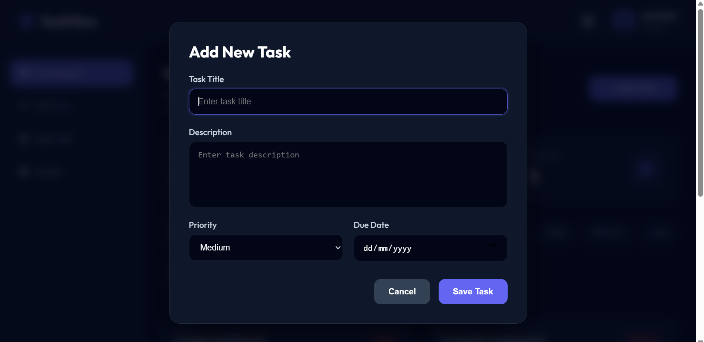

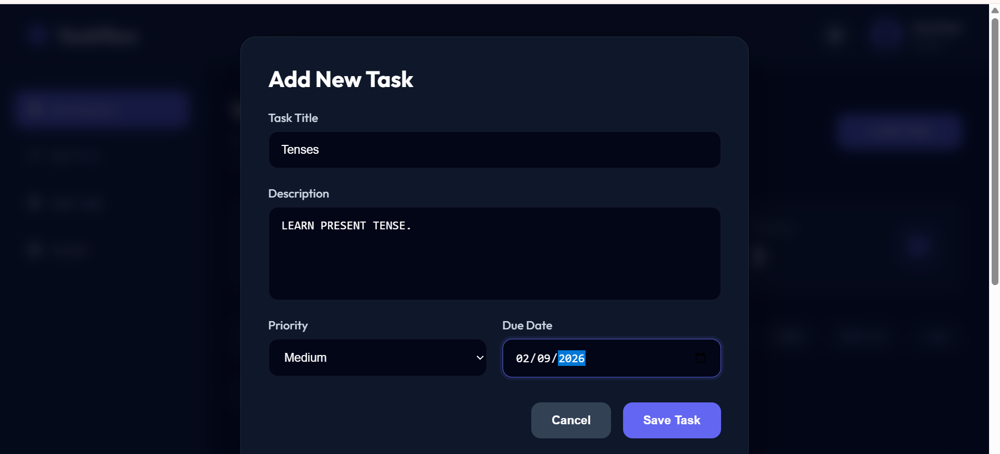

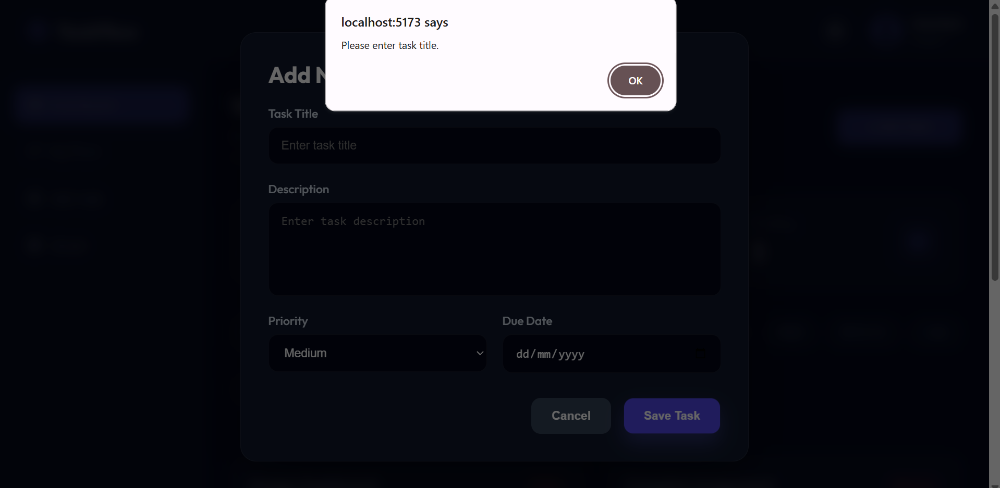

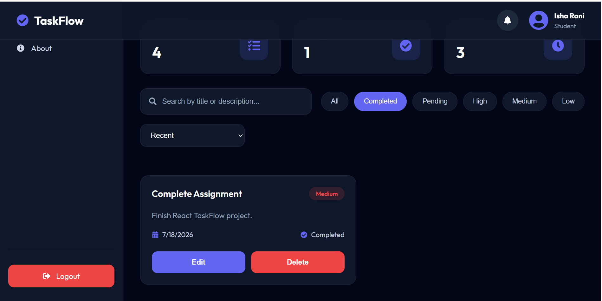

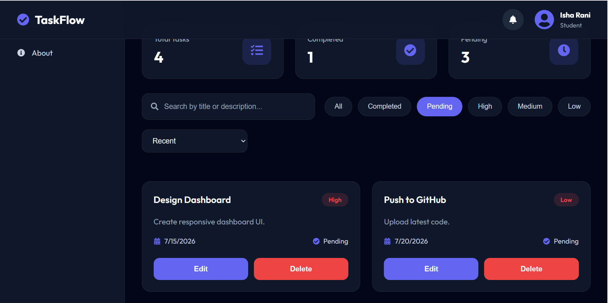
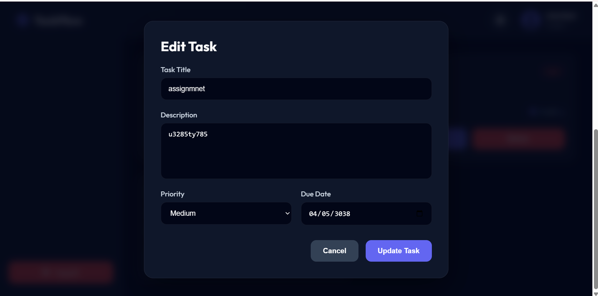


## About Page

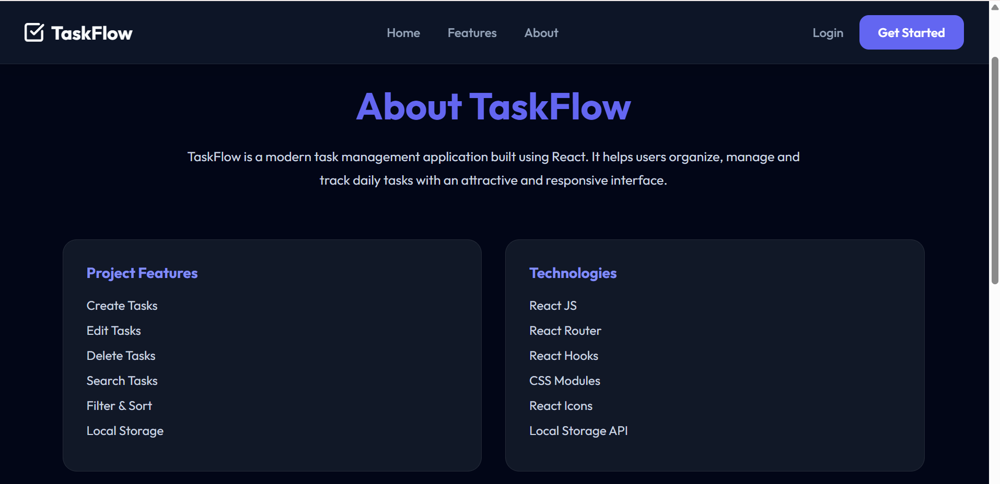

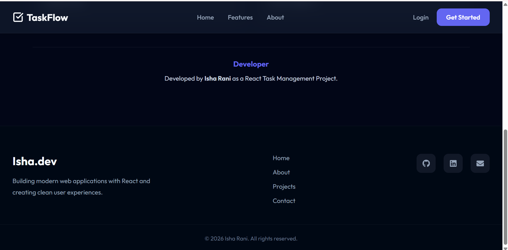

## NotFound Page

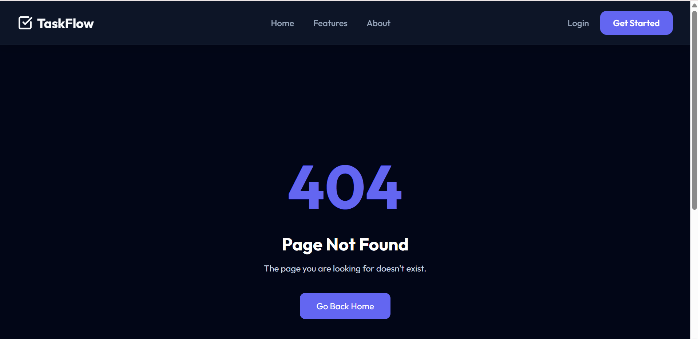
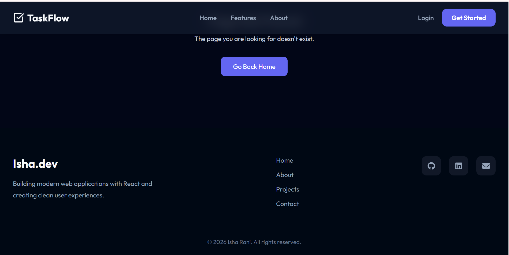

# Technologies Used

## Frontend

* React.js
* Vite
* JavaScript (ES6+)
* CSS Modules
* React Router DOM
* React Icons

# React Concepts Implemented

This project demonstrates the following React concepts:

* Functional Components
* Components and Props
* State Management using useState
* useMemo Hook
* useRef Hook
* Custom Hooks
* Event Handling
* Conditional Rendering
* Lists and Keys
* Forms Handling
* LocalStorage Integration

# Project Structure

```text
src
│
├── assets
│   ├── fonts
│   └── images
│
├── components
│   ├── Navbar
│   ├── Footer
│   ├── Hero
│   ├── Features
│   ├── CTA
│   └── Dashboard
│       ├── DashboardNavbar
│       ├── Sidebar
│       ├── DashboardHeader
│       ├── StatCard
│       ├── SearchBar
│       ├── FilterBar
│       ├── SortDropdown
│       ├── TaskList
│       ├── TaskCard
│       ├── TaskForm
│       └── Modal
│
├── data
│   ├── filters.js
│   ├── priorities.js
│   └── sortOptions.js
│
├── hooks
│   └── useLocalStorage.js
│
├── pages
│   ├── Home
│   ├── Login
│   ├── Register
│   ├── Dashboard
│   ├── About
│   └── NotFound
│
├── services
│   └── taskService.js
│
├── utils
│   └── formatDate.js
│
├── App.jsx
└── main.jsx
```

# Application Routes

| Route        | Description               |
| ------------ | ------------------------- |
| `/`          | Home Page                 |
| `/login`     | Login Page (UI Only)      |
| `/register`  | Register Page (UI Only)   |
| `/dashboard` | Task Management Dashboard |
| `/about`     | About Page                |
| `/404`       | Not Found Page            |

# Installation & Setup

Follow these steps to run the project locally:

## 1. Clone Repository

```bash
git clone https://github.com/Isharani01/taskflow.git
```

## 2. Navigate to Project Folder

```bash
cd taskflow
```

## 3. Install Dependencies

```bash
npm install
```

## 4. Start Development Server

```bash
npm run dev
```

The application will run on:

```text
http://localhost:5173/
```

# Live Demo

Not deployed yet.

# Additional Features

* Responsive user interface
* Reusable React components
* Custom LocalStorage hook
* Dynamic filters and sorting options
* Modular CSS architecture
* Clean component organization

# Future Improvements

* Backend authentication
* Database integration
* User profiles
* Drag and drop task management
* Task categories
* Notifications system
* Theme customization

# Author

**Isha Rani**

BS Computer Science Student.
Frontend Developer.

# License

This project is developed for educational and internship purposes.
